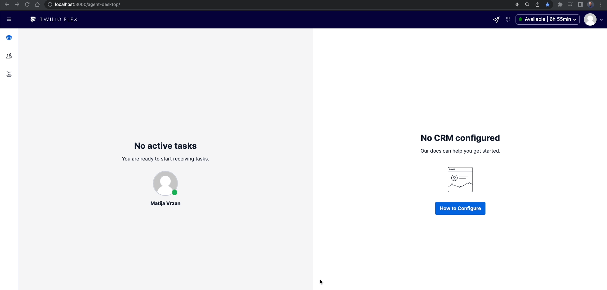
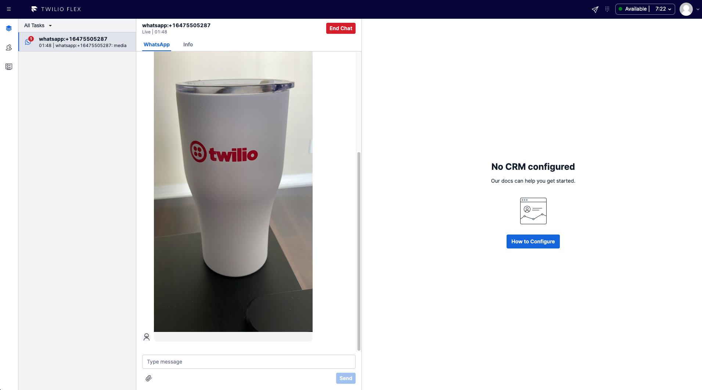
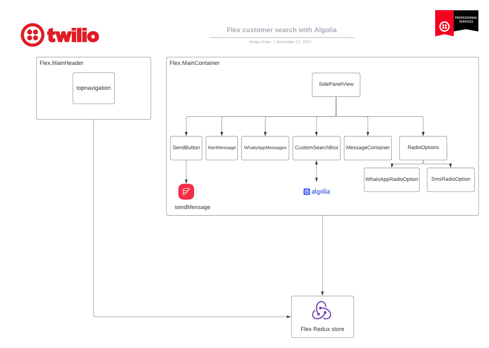

<a  href="https://www.twilio.com">

</a>

# Chat: Customer Directory with Algolia Search

Twilio Flex Plugins allow you to customize the appearance and behavior of [Twilio Flex](https://www.twilio.com/flex). If you want to learn more about the capabilities and how to use the API, check out our [Flex documentation](https://www.twilio.com/docs/flex).

## How it works

The _Chat Customer Directory Plugin_ enables agents to search for specific customers by name, before sending an individual or group SMS or WhatsApp message.


Customer search component is powered by [Algolia search engine](https://www.algolia.com/). As agents search for customer, a request is sent to the algolia search and the results are rendered back to the agent.

The plugin also allows agents to send outbound SMS or WhatsApp message to both individual customers or initiate a group chat.


When sending a WhatsApp message, the initial message has to be a pre-approved WhatsApp template. For more information about this process, please check my [blog post](https://www.twilio.com/blog/twilio-flex-whatsapp-integration-checklist).



If you decide to send a group message, a new task will open for the agent right away. Chat communication is powered by the Conversations API.


## Algolia Search Setup

For the Algolia search to work with this use case, there are a few required steps. The first on is to add the Algolia Application ID and Search Only API Key into the .env file:

```
REACT_APP_ALGOLIA_APPLICATION_ID=xxxx
REACT_APP_ALGOLIA_SEARCH_ONLY_API_KEY=xxxx
```

The next step is to have the project json data structure within Algolia. Here is an example of the Algolia data structure:

```
[
  {
    "customerName": "Vatija Mrzan",
    "number": "+1234567891"
  },
  {
    "customerName": "Vudo Llieger",
    "number": "+1234567810"
  },
  {
    "customerName": "Fohn Jischelli",
    "number": "+1234567811"
  },
]
```

And that is it! You will be able to search for customer via their names within the Flex UI.

> Please note that the above is just a simple example of how an external data structure could be configured. Production use cases and security aspects should be evaluated before implementation.

The search engine behind the customer search is [Algolia](https://www.algolia.com/).

## Media support

This plugin also enables media support within the Flex UI. This means that you will be able to view images, play video, and listen to audio messages directly from the Flex UI, instead of opening them in a new tab or downloading them.



### How does media support work?

Conversations API has a native support for media; however, Flex UI does not. In order to display the media within the Flex UI, we have to replace the [MessageBubbleComponent](https://assets.flex.twilio.com/docs/releases/flex-ui/2.1.0/programmable-components/components/MessageBubble/) with a custom component that uses HTML5 tags to render the media to the Worker/Agent.

## Architecture



## Limitations and improvements

**WhatsApp Templates**

At the time of creating this template, there are no APIs that would allow you to fetch a list of approved WhatsApp templates from the Twilio console. Therefore, it is necessary to hardcode the approved template values somewhere. This plugin is currently storing template values in the Flex plugin; however, a better option would be to store them as a part of the serverless function assets and fetching them via separate HTTP call. This approach would allow for independent updates from the Flex UI.

**Outbound message limit**

When sending multiple individual messages (either SMS or WhatsApp), it is possible to hit the 10 seconds serverless function execution limit. Depending on the number of customers, you might want to consider a queuing mechanism or batching your requests.

## Development

Run `twilio flex:plugins --help` to see all the commands we currently support. For further details on Flex Plugins refer to our documentation on the [Twilio Docs](https://www.twilio.com/docs/flex/developer/plugins/cli) page.

# Configuration

## Requirements

To deploy this plugin, you will need:

- An active Twilio account with Flex provisioned. Refer to the [Flex Quickstart](https://www.twilio.com/docs/flex/quickstart/flex-basics#sign-up-for-or-sign-in-to-twilio-and-create-a-new-flex-project%22) to create one.
- npm version 5.0.0 or later installed (type `npm -v` in your terminal to check)
- Node.js version 12 or later installed (type `node -v` in your terminal to check). _Even_ versions of Node are. **Note:** In order to install Twilio Flex CLI plugin that is needed for locally running Flex, Node version 16 is the latest supported version (if you are using Node 18., please revert back or use Node Version Manager).
- [Twilio CLI](https://www.twilio.com/docs/twilio-cli/quickstart#install-twilio-cli) along with the [Flex CLI Plugin](https://www.twilio.com/docs/twilio-cli/plugins#available-plugins) and the [Serverless Plugin](https://www.twilio.com/docs/twilio-cli/plugins#available-plugins). Run the following commands to install them:

```
# Install the Twilio CLI
npm install twilio-cli -g
# Install the Serverless and Flex as Plugins
twilio plugins:install @twilio-labs/plugin-serverless
twilio plugins:install @twilio-labs/plugin-flex
```

- Once the Twilio CLI and Twilio Flex CLI plugins are successfully installed, configure your [Twilio CLI profile](https://www.twilio.com/docs/twilio-cli/general-usage). **Note:** This step is required if you are running Twilio CLI for the first time or if you have multiple Twilio CLI profiles configured.

## Setup

Install the dependencies by running `npm install`:

```bash
cd chat-customer-directory
npm install
```

From the root directory, rename `public/appConfig.example.js` to `public/appConfig.js`.

```bash
mv public/appConfig.example.js public/appConfig.js
```

## Serverless Functions

### Deployment

Create the Serverless config file by copying `.env.example` to `.env`.

```bash
cd serverless
cp .env.example .env
```

Edit `.env` and set these variables with the Sids from your account.

```bash
# The following values are example references only
REACT_APP_ALGOLIA_APPLICATION_ID=xxxx
REACT_APP_ALGOLIA_SEARCH_ONLY_API_KEY=xxxx
REACT_APP_TWILIO_SERVERLESS_SERVICE=https://xxx.twil.io
REACT_APP_TWILIO_WHATSAPP_FROM_NUMBER=+1xxxx
REACT_APP_TWILIO_FROM_NUMBER=+1xxxx
REACT_APP_WORKSPACE_SID=WSxxxx
REACT_APP_WORKFLOW_SID=WWxxxx
REACT_APP_QUEUE_SID=WQxxxx
REACT_APP_INBOUND_STUDIO_FLOW=FWxxxx
```

Next, deploy the Serverless functions:

```bash
cd serverless
twilio serverless:deploy

```

After successfully deploying your function, you should see at least the following:

```bash
✔ Serverless project successfully deployed


Deployment Details
Domain: xxx-xxx-xxxx-dev.twil.io

Functions:
   https://xxx-xxx-xxxx-dev.twil.io/sendMessage
(more)
```

Your functions will now be present in the Twilio Functions Console and be part of the "serverless" service. Copy the base URL from the function.

## Flex Plugin

### Development

Create the plugin config file by copying `.env.example` to `.env`.

```bash
cd chat-customer-directory
cp .env.example .env
```

To run the plugin locally, you can use the Twilio Flex CLI plugin. Using your command line, run the following from the root directory of the plugin.

```bash
cd chat-customer-directory
twilio flex:plugins:start
```

This will automatically start up the webpack dev server and open the browser for you. Your app will run on `http://localhost:3000`.

When you make changes to your code, the browser window will be automatically refreshed.

### Deploy your Flex Plugin

Once you are happy with your Flex plugin, you have to deploy then release it on your Flex application.

Run the following command to start the deployment:

```bash
twilio flex:plugins:deploy --major --changelog "Releasing Chat Customer Directory" --description "Chat Customer Directory with Algolia search"
```

After running the suggested next step, navigate to the [Plugins Dashboard](https://flex.twilio.com/admin/) to review your recently deployed plugin and confirm that it’s enabled for your contact center.

**Note:** Common packages like `React`, `ReactDOM`, `Redux` and `ReactRedux` are not bundled with the build because they are treated as external dependencies so the plugin will depend on Flex to provide them globally.

You are all set to test this plugin on your Flex application!

## Deployment to QA, Staging and Production environments

### CLI Profiles

Create Twilio CLI Profiles for each environment using

`twilio profiles:create`

This command will prompt your for the Account Sid, Auth Token and and a name/label for the profile. We recommend that the Profile Name matches the Twilio Account name to avoid confusion

To switch between profiles:

`twilio profiles:use "ProfileName"`

To check the configured profiles:

`twilio profiles:list`

### Serverless

Follow the steps in this [guide](https://www.twilio.com/docs/labs/serverless-toolkit/deploying) to deploy Serverless functions to multiple accounts/environment.

Using `.env.example` create `.env.stage` and `.env.prod` files and update each with the correct resource Sids from the respective account.
Note: Make sure your .gitignore contains the names of these files so they will be excluded from any commit to your repo.

After switching the CLI to use a different profile (i.e. Account Sid), you can use these commands to deploy the serverless functions with the correct set of environment variables.

`twilio serverless:deploy --env .env.stage --environment=staging`

`twilio serverless:deploy --env .env.prod --environment=production`

### Plugin

Follow the steps in this [guide](https://www.twilio.com/docs/flex/developer/plugins/environment-variables) to configure your plugin for deployment to multiple environments.

Using `.env.example` create `.env.stage` and `.env.prod` files and update each with the correct resource Sids from the respective account.
Note: Make sure your .gitignore contains the names of these files so they will be excluded from any commit to your repo.

To deploy your plugin to specific accounts/environments use these commands:

`twilio flex:plugins:deploy --profile:StageProfileName`

`twilio flex:plugins:deploy --profile:ProdProfileName`

### Studio SendToFlex

To handle the use case of inbound replies from the customer needing to create a task and optionally routing it to the agent that initiated the outbound message we will make use of the sendOutboundSMS function populating the converstations channel attributes.

These are then available in the trigger and modifying the SendToFlex attributes as below will populate the task attributes for the TaskRouter Workflow.

```
{"KnownAgentRoutingFlag":"{{trigger.conversation.ChannelAttributes.KnownAgentRoutingFlag}}", "KnownAgentWorkerFriendlyName":"{{trigger.conversation.ChannelAttributes.KnownAgentWorkerFriendlyName}}"}
```

### TaskRouter Workflow

This workflow assumes that studio has populated the Task Attributes with

- AttributesKnownAgentRoutingFlag
- KnownAgentWorkerFriendlyName

```
{
  "task_routing": {
    "filters": [
      {
        "filter_friendly_name": "Known Agent Routing Filter",
        "expression": "KnownAgentRoutingFlag == \"true\"",
        "targets": [
          {
            "queue": "WQxxxx",
            "known_worker_friendly_name": "task.KnownAgentWorkerFriendlyName"
          }
        ]
      }
    ],
    "default_filter": {
      "queue": "WQxxxx"
    }
  }
```

## License

[MIT](http://www.opensource.org/licenses/mit-license.html)

## Disclaimer

This software is to be considered "sample code", a Type B Deliverable, and is delivered "as-is" to the user. Twilio bears no responsibility to support the use or implementation of this software.

Any resemblance within the plugin to real persons, living or dead, is purely coincidental.

### Kudos

Special thanks to [Darren Hamilton](https://github.com/dahamilton-twilio) for his work on the outbound messaging panel plugin.
